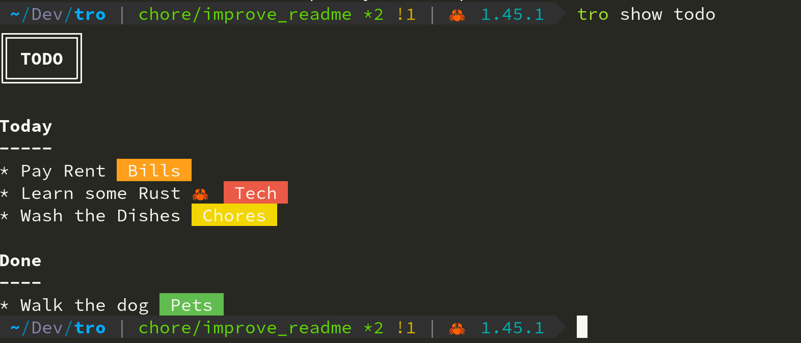
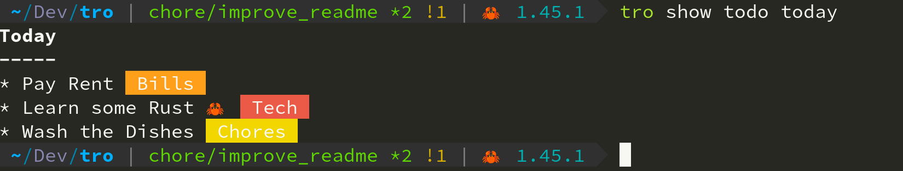
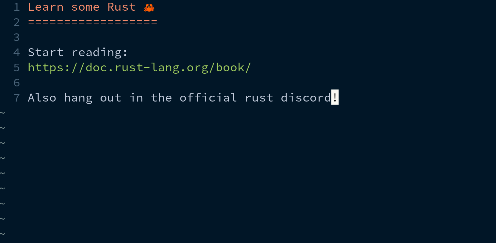
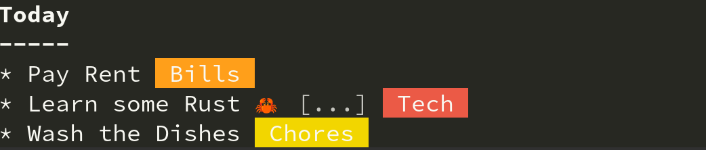

TRO
===

|CircleCI| |CratesIO|

``tro`` is a Trello API client for the command line written in rust.

Installation
------------

Currently, the only way to install is through cargo

::

   cargo install tro

Setup
-----

Run ``tro setup`` to setup tro for the first time.

Take a look at ``tro --help`` for a list of all available subcommands after that.

Available Subcommands
---------------------

* setup: Setup tro for the first time
* show: Show an object (Board, List or Card)
* search: Search for Trello cards
* create: Create an object
* open: Open an object that has been closed
* close: Close an object
* label: Apply or remove a label on a card
* url: Display the url of an object
* attach: Attach a file to a Card
* attachments: View attachments on a Card

How it works
------------

Most of the subcommands in this tool work by specifying one or more patterns in the form of:

::

    <board pattern> <list pattern> <card pattern>

Patterns are simple regex pattern matches. You can specify simple patterns such as substrings too.

``tro`` then attempts to find the object(s) you requested using this process:

* If ``tro`` does not manage to find a match for one or more if the items specified, then it will display an appropriate error.

* If ``tro`` manages to find a unique match for each of the items specified, then it will successfully display the object(s) you requested.

* If ``tro`` finds any of the patterns are matched with multiple possible items, then the tool will be unable to precisely determine which object you were referring to and do its best to explain why.

Usage Examples
--------------

Some examples of how patterns can be specified. Say we have a board named "todo list" with two lists named "today" and "done".

We can show the entire board by just specifying a portion of the board name:

If we want to only see a specific list within the board, we can specify a list pattern:

If we want to edit a specific card, then we can also specify a card pattern. This will open our default editor (specified by the ``EDITOR`` environment variable) so that we can edit the contents of our card.

For example, running ``tro show todo today rust`` would open vim:

A card which has contents can be easily spotted by the ``[...]`` marker when viewing a board or list:

Interactive Mode
----------------

Most subcommands have an interactive mode that can be enabled by passing the ``--interactive`` or ``-i`` flag.

Interactive mode provides a simple keyboard interface to choose relative items when possible.

.. |CircleCI| image:: https://circleci.com/gh/MichaelAquilina/tro.svg?style=svg
   :target: https://circleci.com/gh/MichaelAquilina/tro

.. |CratesIO| image:: https://img.shields.io/crates/v/tro.svg
   :target: https://crates.io/crates/tro
