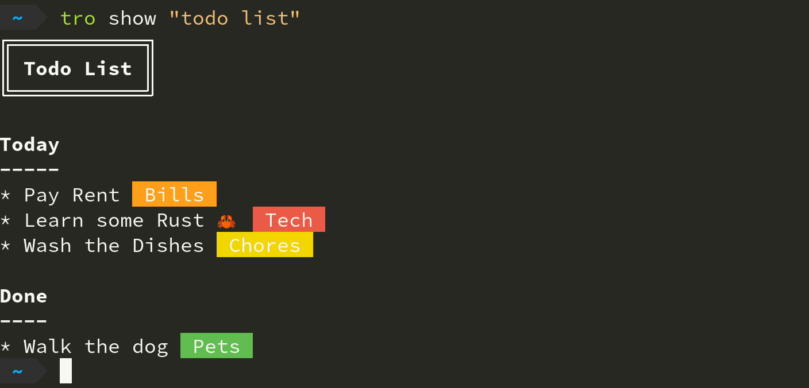

TRO
===

|CircleCI| |CratesIO|

``tro`` is a Trello API client for the command line written in rust.

Installation
------------

Currently, the only way to install is through cargo

::

   cargo install tro

Setup
-----

Run ``tro setup`` to setup tro for the first time.

Take a look at ``tro --help`` for a list of all available subcommands after that.

How it works
------------

Most of the subcommands in this tool work by specifying one or more patterns in the form of:

::

    <board> <list> <card>

Patterns are simple regex pattern matches. You can specify simple patterns such as substrings too.

``tro`` then attempts to find the object(s) you requested using this process:

* If the tool does not manage to find a match for one or more if the items specified, then it will display an appropriate error.

* If the tool manages to find a unique match for each of the items specified, then it will successfully display the object(s) you requested.

* If one or more of the patterns are matched with multiple possible items, then the tool will fail to retrieve the object(s) you requested and do its best to explain why.

Commands
--------

Some examples of commands you can run:

**Show all board names**

::

    $ tro show
    * TODO
    * Groceries
    * Recipes

**Show a specific board**

::

    $ tro show todo
    TODO
    ====

    Today
    -----
    * Wash Dishes
    * Walk Dog
    * Learn some Rust

**Create a new card**

::

    $ tro create TODO Today
    Card name: my new card

OR

::

    $ tro show TODO Today -n
    <your $EDITOR will open>

**Edit an existing card**

::

    $ tro show TODO Today "my new card"
    <your $EDITOR will open>

**Close a card**

::

    $ tro close TODO Today "my new card"
    Closed card 'my new card'

**Show a url**

::

    $ tro url TODO
    https://trello.com/b/9ftbid5U/todo

.. |CircleCI| image:: https://circleci.com/gh/MichaelAquilina/tro.svg?style=svg
   :target: https://circleci.com/gh/MichaelAquilina/tro

.. |CratesIO| image:: https://img.shields.io/crates/v/tro.svg
   :target: https://crates.io/crates/tro
